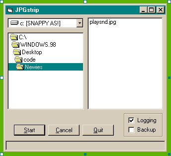



## JpgStrip v1 Freeware Source Code

### Description

This JPEG strip code is in response to a recent submission on JPEG info extraction. This code was developed by David Crowell using vb5, so don't vote. I posted it for those interested in learning more about the internals of the JPEG graphic format. Please follow Davids request to leave this zip archive intact if you re-distribute it. This is version 1, and David is still developing it, he has a freeware exe version 1.3 available at:

www.ksurf.net/~bermania/prog/dessin/jpgstrip.zip

I don't know whether sourse code is available.
 
### More Info
 

             |
---                |---
**Submitted On**   |2004-02-11 16:48:50
**By**             |[Rde](https://github.com/Planet-Source-Code/PSCIndex/blob/master/ByAuthor/rde.md)
**Level**          |Intermediate
**User Rating**    |5.0 (10 globes from 2 users)
**Compatibility**  |VB 5\.0, VB 6\.0
**Category**       |[Graphics](https://github.com/Planet-Source-Code/PSCIndex/blob/master/ByCategory/graphics__1-46.md)
**World**          |[Visual Basic](https://github.com/Planet-Source-Code/PSCIndex/blob/master/ByWorld/visual-basic.md)
**Archive File**   |[JpgStrip\_v1737354252004\.zip](https://github.com/Planet-Source-Code/rde-jpgstrip-v1-freeware-source-code__1-53377/archive/master.zip)

